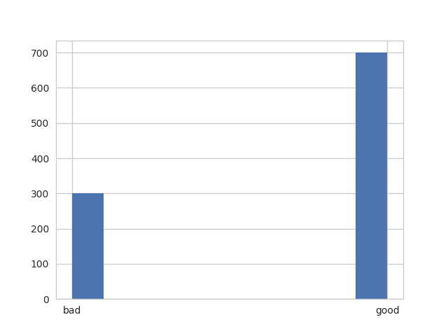
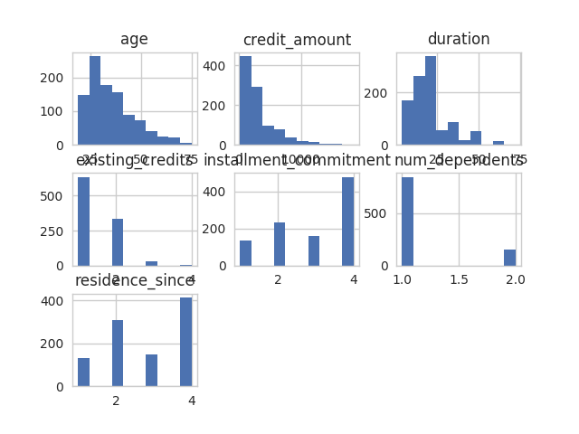
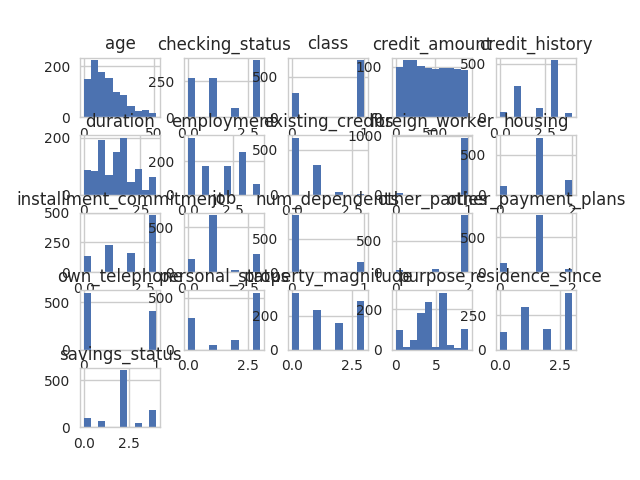
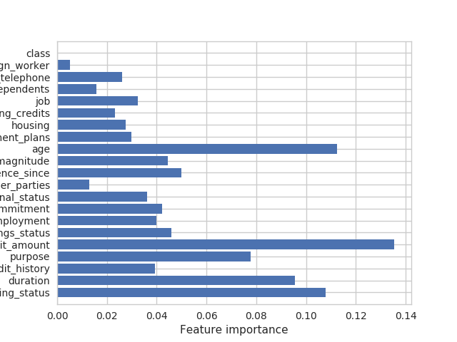

# Predictive analytics on credit report Data 

## Data Description

>> df.columns.values

>>['checking_status' 'duration' 'credit_history' 'purpose' 'credit_amount'
 'savings_status' 'employment' 'installment_commitment' 'personal_status'
 'other_parties' 'residence_since' 'property_magnitude' 'age'
 'other_payment_plans' 'housing' 'existing_credits' 'job' 'num_dependents'
 'own_telephone' 'foreign_worker' 'class']
 
|      | duration     |credit_amount   | installment_commitment | residence_since  |   age         | existing_credits  | num_dependents |  
|------|--------------|----------------|------------------------|------------------|---------------|-------------------|----------------|
|count | 1000.000000  |  1000.000000   | 1000.000000            |    1000.000000   |  1000.000000  |     1000.000000   |  1000.000000   | 
|mean  |   20.903000  |  3271.258000   |    2.973000            |       2.845000   |    35.546000  |        1.407000   |     1.155000   | 
|std   |   12.058814  |  2822.736876   |    1.118715            |       1.103718   |    11.375469  |        0.577654   |     0.362086   | 
|min   |    4.000000  |   250.000000   |    1.000000            |       1.000000   |    19.000000  |        1.000000   |     1.000000   | 
|25%   |   12.000000  |  1365.500000   |    2.000000            |       2.000000   |    27.000000  |        1.000000   |     1.000000   | 
|50%   |   18.000000  |  2319.500000   |    3.000000            |       3.000000   |    33.000000  |        1.000000   |     1.000000   | 
|75%   |   24.000000  |  3972.250000   |    4.000000            |       4.000000   |    42.000000  |        2.000000   |     1.000000   | 
|max   |   72.000000  | 18424.000000   |    4.000000            |       4.000000   |    75.000000  |        4.000000   |     2.000000   | 

 

|          Algorithm     |  Accuracy |  Precision  |  Recall  |  F1-support  |  AUC     |
|------------------------|-----------|-------------|----------|--------------|----------|
|Logistic Regression     | 0.696667  |   0.729167  |0.870647  |    0.793651  |0.607041  |
|Linear SVC              | 0.67      |   0.675862  |0.975124  |    0.798371  |0.512815  |
|Decision Tree classifier| 0.676667  |   0.742991  |0.791045  |    0.766265  |0.617745  |
|Random Forest           | 0.733333  |   0.7713    |0.855721  |    0.811321  |0.670285  |
|Multilayer Perceptron   | 0.663333  |   0.7713    |0.855721  |    0.811321  |0.670285  |

